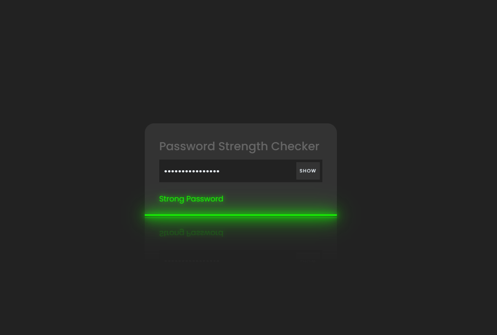

# Password Strength Checker

A web-based **Password Strength Checker** that evaluates the security of user-inputted passwords using various criteria.

## Features
- Provides real-time feedback on password strength.
- Classifies passwords as **Weak, Medium, or Strong** based on complexity.
- User-friendly interface built with **HTML, CSS, and JavaScript**.

## How It Works
The password strength is determined by checking:
- **Length** (longer passwords are stronger)
- **Character variety** (uppercase, lowercase, numbers, special characters)
- **Common patterns** (to prevent easy-to-guess passwords)

## Installation
To run this project locally:
1. Clone the repository:
   ```bash
   git clone https://github.com/11Yashyadav/Password_strength
   ```
2. Navigate to the project folder:
   ```bash
   cd Password_strength
   ```
3. Open `index.html` in a web browser.

## Usage
1. Enter a password in the input field.
2. The tool will analyze its strength and provide feedback.
3. Improve the password by following the recommendations.

## Files Overview
- `index.html` - Main structure of the web app.
- `style.css` - Styles for the web page.
- `script.js` - JavaScript logic for analyzing password strength.

## Example
A **weak password**:
```
123456
```
A **strong password**:
```
G@v3YrP@ssW0rd!98
```

## Preview
### Weak Password Example


### Strong Password Example



## Author
Developed by **Yash Yadav**.

